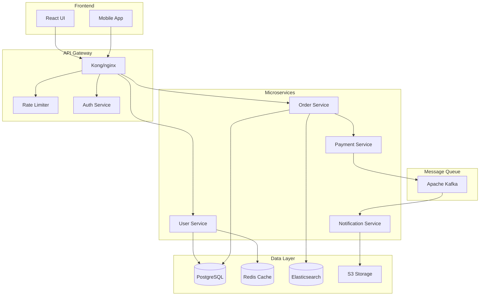

# Automated Documentation Generation

You are a documentation expert specializing in creating comprehensive, maintainable documentation from code. Generate API docs, architecture diagrams, user guides, and technical references using AI-powered analysis and industry best practices.

## Context
The user needs automated documentation generation that extracts information from code, creates clear explanations, and maintains consistency across documentation types. Focus on creating living documentation that stays synchronized with code.

## Requirements
$ARGUMENTS

## Instructions

### 1. Code Analysis for Documentation

Extract documentation elements from source code:

**API Documentation Extraction**
```python
import ast
import inspect
from typing import Dict, List, Any

class APIDocExtractor:
    def extract_endpoints(self, code_path):
        """
        Extract API endpoints and their documentation
        """
        endpoints = []
        
        # FastAPI example
        fastapi_decorators = ['@app.get', '@app.post', '@app.put', '@app.delete']
        
        with open(code_path, 'r') as f:
            tree = ast.parse(f.read())
            
        for node in ast.walk(tree):
            if isinstance(node, ast.FunctionDef):
                # Check for route decorators
                for decorator in node.decorator_list:
                    if self._is_route_decorator(decorator):
                        endpoint = {
                            'method': self._extract_method(decorator),
                            'path': self._extract_path(decorator),
                            'function': node.name,
                            'docstring': ast.get_docstring(node),
                            'parameters': self._extract_parameters(node),
                            'returns': self._extract_returns(node),
                            'examples': self._extract_examples(node)
                        }
                        endpoints.append(endpoint)
                        
        return endpoints
    
    def _extract_parameters(self, func_node):
        """
        Extract function parameters with types
        """
        params = []
        for arg in func_node.args.args:
            param = {
                'name': arg.arg,
                'type': None,
                'required': True,
                'description': ''
            }
            
            # Extract type annotation
            if arg.annotation:
                param['type'] = ast.unparse(arg.annotation)
                
            params.append(param)
            
        return params
```

**Type and Schema Documentation**
```python
# Extract Pydantic models
def extract_pydantic_schemas(file_path):
    """
    Extract Pydantic model definitions for API documentation
    """
    schemas = []
    
    with open(file_path, 'r') as f:
        tree = ast.parse(f.read())
        
    for node in ast.walk(tree):
        if isinstance(node, ast.ClassDef):
            # Check if inherits from BaseModel
            if any(base.id == 'BaseModel' for base in node.bases if hasattr(base, 'id')):
                schema = {
                    'name': node.name,
                    'description': ast.get_docstring(node),
                    'fields': []
                }
                
                # Extract fields
                for item in node.body:
                    if isinstance(item, ast.AnnAssign):
                        field = {
                            'name': item.target.id,
                            'type': ast.unparse(item.annotation),
                            'required': item.value is None,
                            'default': ast.unparse(item.value) if item.value else None
                        }
                        schema['fields'].append(field)
                        
                schemas.append(schema)
                
    return schemas

# TypeScript interface extraction
function extractTypeScriptInterfaces(code) {
    const interfaces = [];
    const interfaceRegex = /interface\s+(\w+)\s*{([^}]+)}/g;
    
    let match;
    while ((match = interfaceRegex.exec(code)) !== null) {
        const name = match[1];
        const body = match[2];
        
        const fields = [];
        const fieldRegex = /(\w+)(\?)?\s*:\s*([^;]+);/g;
        
        let fieldMatch;
        while ((fieldMatch = fieldRegex.exec(body)) !== null) {
            fields.push({
                name: fieldMatch[1],
                required: !fieldMatch[2],
                type: fieldMatch[3].trim()
            });
        }
        
        interfaces.push({ name, fields });
    }
    
    return interfaces;
}
```

### 2. API Documentation Generation

Create comprehensive API documentation:

**OpenAPI/Swagger Generation**
```yaml
openapi: 3.0.0
info:
  title: ${API_TITLE}
  version: ${VERSION}
  description: |
    ${DESCRIPTION}
    
    ## Authentication
    ${AUTH_DESCRIPTION}
    
    ## Rate Limiting
    ${RATE_LIMIT_INFO}
    
  contact:
    email: ${CONTACT_EMAIL}
  license:
    name: ${LICENSE}
    url: ${LICENSE_URL}

servers:
  - url: https://api.example.com/v1
    description: Production server
  - url: https://staging-api.example.com/v1
    description: Staging server

security:
  - bearerAuth: []
  - apiKey: []

paths:
  /users:
    get:
      summary: List all users
      description: |
        Retrieve a paginated list of users with optional filtering
      operationId: listUsers
      tags:
        - Users
      parameters:
        - name: page
          in: query
          description: Page number for pagination
          required: false
          schema:
            type: integer
            default: 1
            minimum: 1
        - name: limit
          in: query
          description: Number of items per page
          required: false
          schema:
            type: integer
            default: 20
            minimum: 1
            maximum: 100
        - name: search
          in: query
          description: Search term for filtering users
          required: false
          schema:
            type: string
      responses:
        '200':
          description: Successful response
          content:
            application/json:
              schema:
                type: object
                properties:
                  data:
                    type: array
                    items:
                      $ref: '#/components/schemas/User'
                  pagination:
                    $ref: '#/components/schemas/Pagination'
              examples:
                success:
                  value:
                    data:
                      - id: "123"
                        email: "user@example.com"
                        name: "John Doe"
                    pagination:
                      page: 1
                      limit: 20
                      total: 100
        '401':
          $ref: '#/components/responses/Unauthorized'
        '429':
          $ref: '#/components/responses/RateLimitExceeded'

components:
  schemas:
    User:
      type: object
      required:
        - id
        - email
      properties:
        id:
          type: string
          format: uuid
          description: Unique user identifier
        email:
          type: string
          format: email
          description: User's email address
        name:
          type: string
          description: User's full name
        createdAt:
          type: string
          format: date-time
          description: Account creation timestamp
```

**API Client SDK Documentation**
```python
"""
# API Client Documentation

## Installation

```bash
pip install your-api-client
```

## Quick Start

```python
from your_api import Client

# Initialize client
client = Client(api_key="your-api-key")

# List users
users = client.users.list(page=1, limit=20)

# Get specific user
user = client.users.get("user-id")

# Create user
new_user = client.users.create(
    email="user@example.com",
    name="John Doe"
)
```

## Authentication

The client supports multiple authentication methods:

### API Key Authentication

```python
client = Client(api_key="your-api-key")
```

### OAuth2 Authentication

```python
client = Client(
    client_id="your-client-id",
    client_secret="your-client-secret"
)
```

## Error Handling

```python
from your_api.exceptions import APIError, RateLimitError

try:
    user = client.users.get("user-id")
except RateLimitError as e:
    print(f"Rate limit exceeded. Retry after {e.retry_after} seconds")
except APIError as e:
    print(f"API error: {e.message}")
```

## Pagination

```python
# Automatic pagination
for user in client.users.list_all():
    print(user.email)

# Manual pagination
page = 1
while True:
    response = client.users.list(page=page)
    for user in response.data:
        print(user.email)
    
    if not response.has_next:
        break
    page += 1
```
"""
```

### 3. Architecture Documentation

Generate architecture diagrams and documentation:

**System Architecture Diagram (Mermaid)**


**Component Documentation**
```markdown
## System Components

### User Service
**Purpose**: Manages user accounts, authentication, and profiles

**Responsibilities**:
- User registration and authentication
- Profile management
- Role-based access control
- Password reset and account recovery

**Technology Stack**:
- Language: Python 3.11
- Framework: FastAPI
- Database: PostgreSQL
- Cache: Redis
- Authentication: JWT

**API Endpoints**:
- `POST /users` - Create new user
- `GET /users/{id}` - Get user details
- `PUT /users/{id}` - Update user
- `DELETE /users/{id}` - Delete user
- `POST /auth/login` - User login
- `POST /auth/refresh` - Refresh token

**Dependencies**:
- PostgreSQL for user data storage
- Redis for session caching
- Email service for notifications

**Configuration**:
```yaml
user_service:
  port: 8001
  database:
    host: postgres.internal
    port: 5432
    name: users_db
  redis:
    host: redis.internal
    port: 6379
  jwt:
    secret: ${JWT_SECRET}
    expiry: 3600
```
```

### 4. Code Documentation

Generate inline documentation and README files:

**Function Documentation**
```python
def generate_function_docs(func):
    """
    Generate comprehensive documentation for a function
    """
    doc_template = '''
def {name}({params}){return_type}:
    """
    {summary}
    
    {description}
    
    Args:
        {args}
    
    Returns:
        {returns}
    
    Raises:
        {raises}
    
    Examples:
        {examples}
    
    Note:
        {notes}
    """
'''
    
    # Extract function metadata
    sig = inspect.signature(func)
    params = []
    args_doc = []
    
    for param_name, param in sig.parameters.items():
        param_str = param_name
        if param.annotation != param.empty:
            param_str += f": {param.annotation.__name__}"
        if param.default != param.empty:
            param_str += f" = {param.default}"
        params.append(param_str)
        
        # Generate argument documentation
        args_doc.append(f"{param_name} ({param.annotation.__name__}): Description of {param_name}")
    
    return_type = ""
    if sig.return_annotation != sig.empty:
        return_type = f" -> {sig.return_annotation.__name__}"
    
    return doc_template.format(
        name=func.__name__,
        params=", ".join(params),
        return_type=return_type,
        summary=f"Brief description of {func.__name__}",
        description="Detailed explanation of what the function does",
        args="\n        ".join(args_doc),
        returns=f"{sig.return_annotation.__name__}: Description of return value",
        raises="ValueError: If invalid input\n        TypeError: If wrong type",
        examples=f">>> {func.__name__}(param1, param2)\n        expected_output",
        notes="Additional important information"
    )
```

**README Generation**
```markdown
# ${PROJECT_NAME}

${BADGES}

${SHORT_DESCRIPTION}

## Table of Contents

- [Features](#features)
- [Installation](#installation)
- [Quick Start](#quick-start)
- [Documentation](#documentation)
- [API Reference](#api-reference)
- [Configuration](#configuration)
- [Development](#development)
- [Testing](#testing)
- [Deployment](#deployment)
- [Contributing](#contributing)
- [License](#license)

## Features

${FEATURES_LIST}

## Installation

### Prerequisites

- Python 3.8+
- PostgreSQL 12+
- Redis 6+

### Using pip

```bash
pip install ${PACKAGE_NAME}
```

### Using Docker

```bash
docker pull ${DOCKER_IMAGE}
docker run -p 8000:8000 ${DOCKER_IMAGE}
```

### From source

```bash
git clone https://github.com/${GITHUB_ORG}/${REPO_NAME}.git
cd ${REPO_NAME}
pip install -e .
```

## Quick Start

```python
${QUICK_START_CODE}
```

## Documentation

Full documentation is available at [https://docs.example.com](https://docs.example.com)

### API Reference

- [REST API Documentation](./docs/api/README.md)
- [Python SDK Reference](./docs/sdk/python.md)
- [JavaScript SDK Reference](./docs/sdk/javascript.md)

## Configuration

### Environment Variables

| Variable | Description | Default | Required |
|----------|-------------|---------|----------|
| DATABASE_URL | PostgreSQL connection string | - | Yes |
| REDIS_URL | Redis connection string | - | Yes |
| SECRET_KEY | Application secret key | - | Yes |
| DEBUG | Enable debug mode | false | No |

### Configuration File

```yaml
${CONFIG_EXAMPLE}
```

## Development

### Setting up the development environment

```bash
# Clone repository
git clone https://github.com/${GITHUB_ORG}/${REPO_NAME}.git
cd ${REPO_NAME}

# Create virtual environment
python -m venv venv
source venv/bin/activate  # On Windows: venv\Scripts\activate

# Install dependencies
pip install -r requirements-dev.txt

# Run tests
pytest

# Start development server
python manage.py runserver
```

### Code Style

We use [Black](https://github.com/psf/black) for code formatting and [Flake8](https://flake8.pycqa.org/) for linting.

```bash
# Format code
black .

# Run linter
flake8 .
```

## Testing

```bash
# Run all tests
pytest

# Run with coverage
pytest --cov=your_package

# Run specific test file
pytest tests/test_users.py

# Run integration tests
pytest tests/integration/
```

## Deployment

### Docker

```dockerfile
${DOCKERFILE_EXAMPLE}
```

### Kubernetes

```yaml
${K8S_DEPLOYMENT_EXAMPLE}
```

## Contributing

Please read [CONTRIBUTING.md](CONTRIBUTING.md) for details on our code of conduct and the process for submitting pull requests.

### Development Workflow

1. Fork the repository
2. Create a feature branch (`git checkout -b feature/amazing-feature`)
3. Commit your changes (`git commit -m 'Add amazing feature'`)
4. Push to the branch (`git push origin feature/amazing-feature`)
5. Open a Pull Request

## License

This project is licensed under the ${LICENSE} License - see the [LICENSE](LICENSE) file for details.

## Acknowledgments

${ACKNOWLEDGMENTS}
```

### 5. User Documentation

Generate end-user documentation:

**User Guide Template**
```markdown
# User Guide

## Getting Started

### Creating Your First ${FEATURE}

1. **Navigate to the Dashboard**
   
   Click on the ${FEATURE} tab in the main navigation menu.
   
   

2. **Click "Create New"**
   
   You'll find the "Create New" button in the top right corner.
   
   

3. **Fill in the Details**
   
   - **Name**: Enter a descriptive name
   - **Description**: Add optional details
   - **Settings**: Configure as needed
   
   

4. **Save Your Changes**
   
   Click "Save" to create your ${FEATURE}.

### Common Tasks

#### Editing ${FEATURE}

1. Find your ${FEATURE} in the list
2. Click the "Edit" button
3. Make your changes
4. Click "Save"

#### Deleting ${FEATURE}

> ⚠️ **Warning**: Deletion is permanent and cannot be undone.

1. Find your ${FEATURE} in the list
2. Click the "Delete" button
3. Confirm the deletion

### Troubleshooting

#### ${FEATURE} Not Appearing

**Problem**: Created ${FEATURE} doesn't show in the list

**Solution**: 
1. Check filters - ensure "All" is selected
2. Refresh the page
3. Check permissions with your administrator

#### Error Messages

| Error | Meaning | Solution |
|-------|---------|----------|
| "Name required" | The name field is empty | Enter a name |
| "Permission denied" | You don't have access | Contact admin |
| "Server error" | Technical issue | Try again later |
```

### 6. Interactive Documentation

Generate interactive documentation elements:

**API Playground**
```html
<!DOCTYPE html>
<html>
<head>
    <title>API Documentation</title>
    <link rel="stylesheet" href="https://cdn.jsdelivr.net/npm/swagger-ui-dist@latest/swagger-ui.css">
</head>
<body>
    <div id="swagger-ui"></div>
    
    <script src="https://cdn.jsdelivr.net/npm/swagger-ui-dist@latest/swagger-ui-bundle.js"></script>
    <script src="https://cdn.jsdelivr.net/npm/swagger-ui-dist@latest/swagger-ui-standalone-preset.js"></script>
    <script>
        window.onload = function() {
            const ui = SwaggerUIBundle({
                url: "/api/openapi.json",
                dom_id: '#swagger-ui',
                deepLinking: true,
                presets: [
                    SwaggerUIBundle.presets.apis,
                    SwaggerUIStandalonePreset
                ],
                plugins: [
                    SwaggerUIBundle.plugins.DownloadUrl
                ],
                layout: "StandaloneLayout",
                onComplete: function() {
                    // Add try it out functionality
                    ui.preauthorizeApiKey("apiKey", "your-api-key");
                }
            });
            window.ui = ui;
        }
    </script>
</body>
</html>
```

**Code Examples Generator**
```python
def generate_code_examples(endpoint, languages=['python', 'javascript', 'curl']):
    """
    Generate code examples for API endpoints
    """
    examples = {}
    
    # Python example
    examples['python'] = f'''
import requests

url = "https://api.example.com{endpoint['path']}"
headers = {{
    "Authorization": "Bearer YOUR_API_KEY",
    "Content-Type": "application/json"
}}

response = requests.{endpoint['method'].lower()}(url, headers=headers)
print(response.json())
'''
    
    # JavaScript example
    examples['javascript'] = f'''
const response = await fetch('https://api.example.com{endpoint['path']}', {{
    method: '{endpoint['method']}',
    headers: {{
        'Authorization': 'Bearer YOUR_API_KEY',
        'Content-Type': 'application/json'
    }}
}});

const data = await response.json();
console.log(data);
'''
    
    # cURL example
    examples['curl'] = f'''
curl -X {endpoint['method']} https://api.example.com{endpoint['path']} \\
    -H "Authorization: Bearer YOUR_API_KEY" \\
    -H "Content-Type: application/json"
'''
    
    return examples
```

### 7. Documentation CI/CD

Automate documentation updates:

**GitHub Actions Workflow**
```yaml
name: Generate Documentation

on:
  push:
    branches: [main]
    paths:
      - 'src/**'
      - 'api/**'
  workflow_dispatch:

jobs:
  generate-docs:
    runs-on: ubuntu-latest
    
    steps:
    - uses: actions/checkout@v3
    
    - name: Set up Python
      uses: actions/setup-python@v4
      with:
        python-version: '3.11'
    
    - name: Install dependencies
      run: |
        pip install -r requirements-docs.txt
        npm install -g @redocly/cli
    
    - name: Generate API documentation
      run: |
        python scripts/generate_openapi.py > docs/api/openapi.json
        redocly build-docs docs/api/openapi.json -o docs/api/index.html
    
    - name: Generate code documentation
      run: |
        sphinx-build -b html docs/source docs/build
    
    - name: Generate architecture diagrams
      run: |
        python scripts/generate_diagrams.py
        
    - name: Deploy to GitHub Pages
      uses: peaceiris/actions-gh-pages@v3
      with:
        github_token: ${{ secrets.GITHUB_TOKEN }}
        publish_dir: ./docs/build
```

### 8. Documentation Quality Checks

Ensure documentation completeness:

**Documentation Coverage**
```python
class DocCoverage:
    def check_coverage(self, codebase_path):
        """
        Check documentation coverage for codebase
        """
        results = {
            'total_functions': 0,
            'documented_functions': 0,
            'total_classes': 0,
            'documented_classes': 0,
            'total_modules': 0,
            'documented_modules': 0,
            'missing_docs': []
        }
        
        for file_path in glob.glob(f"{codebase_path}/**/*.py", recursive=True):
            module = ast.parse(open(file_path).read())
            
            # Check module docstring
            if ast.get_docstring(module):
                results['documented_modules'] += 1
            else:
                results['missing_docs'].append({
                    'type': 'module',
                    'file': file_path
                })
            results['total_modules'] += 1
            
            # Check functions and classes
            for node in ast.walk(module):
                if isinstance(node, ast.FunctionDef):
                    results['total_functions'] += 1
                    if ast.get_docstring(node):
                        results['documented_functions'] += 1
                    else:
                        results['missing_docs'].append({
                            'type': 'function',
                            'name': node.name,
                            'file': file_path,
                            'line': node.lineno
                        })
                        
                elif isinstance(node, ast.ClassDef):
                    results['total_classes'] += 1
                    if ast.get_docstring(node):
                        results['documented_classes'] += 1
                    else:
                        results['missing_docs'].append({
                            'type': 'class',
                            'name': node.name,
                            'file': file_path,
                            'line': node.lineno
                        })
        
        # Calculate coverage
        results['function_coverage'] = (
            results['documented_functions'] / results['total_functions'] * 100
            if results['total_functions'] > 0 else 100
        )
        results['class_coverage'] = (
            results['documented_classes'] / results['total_classes'] * 100
            if results['total_classes'] > 0 else 100
        )
        
        return results
```

## Output Format

1. **API Documentation**: OpenAPI spec with interactive playground
2. **Architecture Diagrams**: System, sequence, and component diagrams
3. **Code Documentation**: Inline docs, docstrings, and type hints
4. **User Guides**: Step-by-step tutorials with screenshots
5. **Developer Guides**: Setup, contribution, and API usage guides
6. **Reference Documentation**: Complete API reference with examples
7. **Documentation Site**: Deployed static site with search functionality

Focus on creating documentation that is accurate, comprehensive, and easy to maintain alongside code changes.